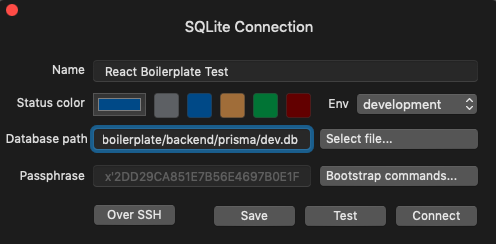
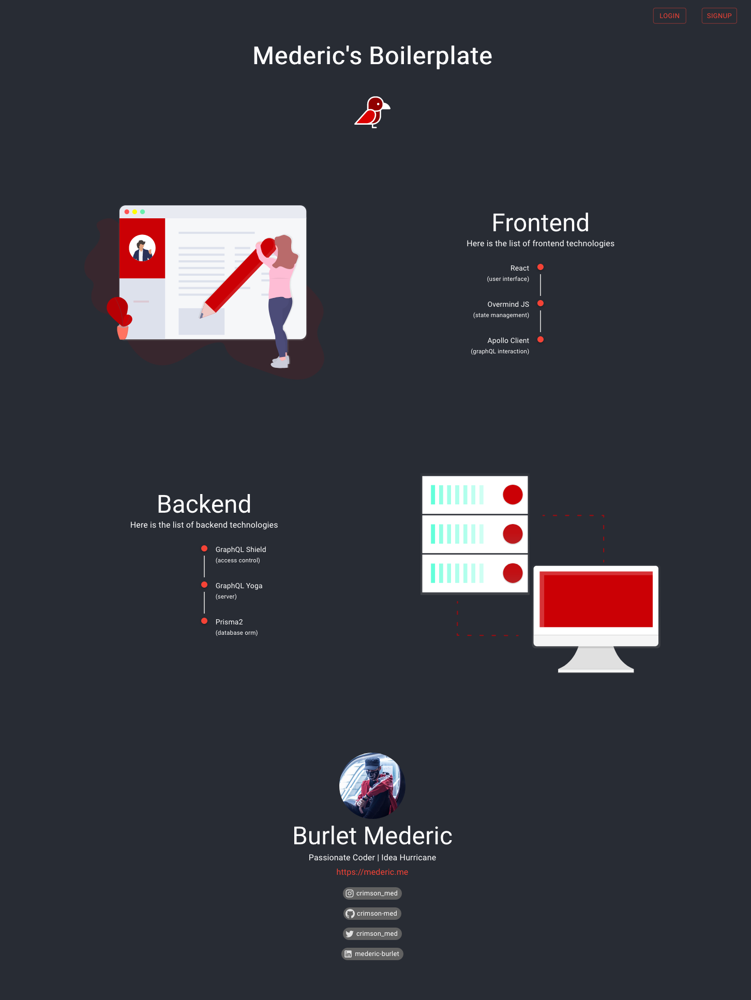
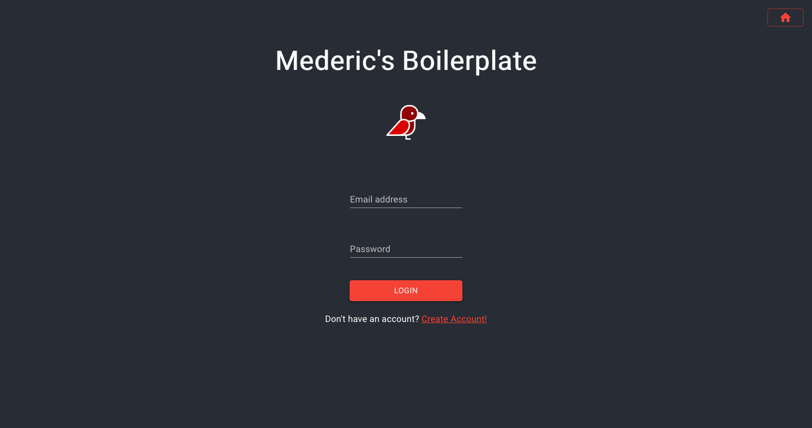
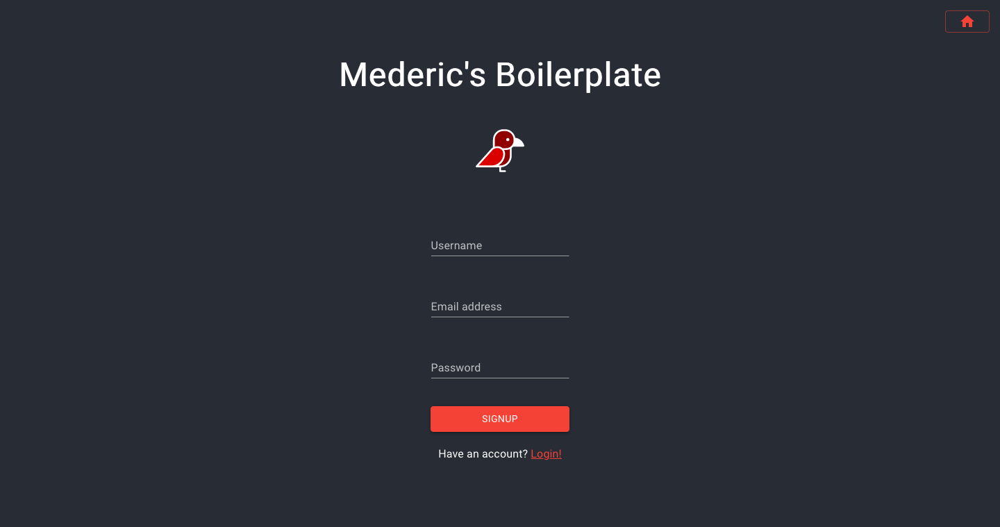
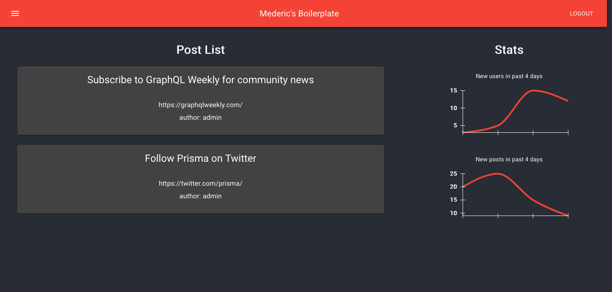

# React Prisma2 GraphQL Boilerplate

Quick start boilerplate leveraging various recent technologies.

## Quickstart

Open two terminals and follow the following commands:

---

| Terminal 1   | Terminal 2   |
|--------------|--------------|
| cd backend   | cd frontend  |
| yarn install | yarn install |
| yarn dev     | yarn start   |

---

That's it you are up and running!

For more detailed documentation check the other readme:

- [BACKEND](backend/README.md)
- [FRONTEND](frontend/README.md)

## Wanna help?

Check out [CONTRIBUTING.md](CONTRIBUTING.md) as well as the project board on GitHub.

## Accessing Datatabase 

For this boilerplate `Prisma2` is connecting to a `SQLite` file in the following folder [backend/prisma](backend/prisma).

To access and explore this file you can use a Database Manager like `TablePlus` which supports `SQLite`. 

You then just need to point to the file:

If you want to change the database to use you can simply update the `datasource` in [backend/prisma/schema.prisma](backend/prisma/schema.prisma).

## Screenshot

Home:

Login:

Signup:

Dashboard:

